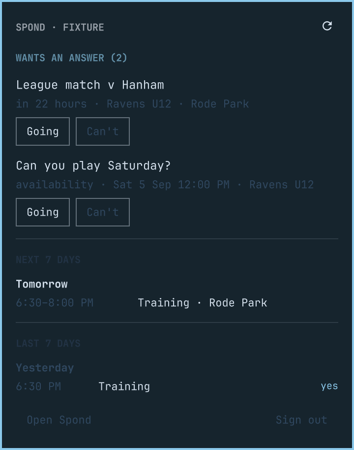

# Spond for Omarchy

What is waiting on an answer, what you have agreed to this week, and what you
did last week — in the Omarchy bar.



<sub>Running on fixture data — the panel says so in its header whenever it is.</sub>

The bar carries a football and the number of invitations waiting on you,
falling back to the time of today's next commitment when nothing is waiting.
The panel has three sections:

- **Wants an answer** — invitations and availability requests nobody has
  replied to, each with Going / Can't. Answering takes two clicks: the first
  chooses, the second sends. What you answer is something other people act on,
  so a mis-click should not be able to tell a coach you are not coming.
- **Next 7 days** — what has been accepted, by day.
- **Last 7 days** — what has finished, and what was answered to each.

Left click opens the panel, middle click refreshes, right click opens Spond in
a browser.

## Requirements

- Omarchy 4.0 or newer (the shell plugin system)
- `curl` and `jq` — both already on an Omarchy box
- `libsecret` (`secret-tool`) if you want the password in your login keyring,
  which you do; without it, it goes in a 0600 file

## Install

```bash
omarchy plugin add https://github.com/digitaljohn/omarchy-spond --enable
```

Then open the panel and sign in: email, password, Sign in. From a terminal, if
you would rather:

```bash
~/.config/omarchy/plugins/digitaljohn.spond/bin/spond login
```

## Uninstall

Sign out first — that is what clears the stored password, the keyring entry and
the cached token. Then remove the plugin:

```bash
~/.config/omarchy/plugins/digitaljohn.spond/bin/spond logout
omarchy plugin remove digitaljohn.spond
```

Signing out from the panel's footer does the same as `logout`. If the plugin
directory has already gone, `secret-tool clear service omarchy-spond account
<your email>` and `rm -rf ~/.config/omarchy-spond ~/.cache/omarchy-spond`
finish the job.

## Your password, and why there is one

Spond publishes no API and has no way to authorise an application: no OAuth, no
app tokens, no scopes. Its own apps sign in with an email and a password and get
a bearer token that expires, and there is no refresh token to renew it with. So
staying signed in means keeping the password, and it is worth knowing exactly
where that goes:

- into your **login keyring** through libsecret when a keyring is running;
  otherwise into `~/.config/omarchy-spond/password`, mode 0600, in a 0700
  directory;
- to Spond over HTTPS, and nowhere else — no telemetry, no third party;
- never into a command line, because `/proc/<pid>/cmdline` is readable by every
  process on the machine. It reaches `curl` through a private temporary file and
  the panel's sign-in reaches the script down a pipe;
- never into the QML beyond the moment between the click and that pipe;
- never into the terminal — nothing here prints it, including `status`.

The access token is cached in `~/.config/omarchy-spond/access-token` and minted
again from the password when it expires.

**Accounts with two-factor authentication cannot sign in here.** A password is
the only credential this can present; if Spond asks for a second factor, the
panel says so and stops.

Like every Omarchy plugin, this runs unsandboxed as you. It is about 600 lines
of bash and 1,200 of QML, and both are worth a read before you trust them with
an account.

## Settings

From the bar widget's settings, or `~/.config/omarchy/shell.json`:

| Setting | Default | What it does |
|---|---|---|
| `scheduleDays` | 7 | How far ahead the schedule section runs |
| `requestDays` | 30 | How far ahead to look for unanswered invitations |
| `historyDays` | 7 | How far back the history section runs; 0 turns it off |
| `pollMinutes` | 15 | How often to ask Spond; opening the panel always refetches |
| `groupId` | — | Restrict to one group; ids from `bin/spond groups` |
| `barStyle` | Requests, then next | What the bar says |
| `barIcon` |  | Change it if your bar font draws a box |
| `panelWidth` | 360 | Panel width, in the shell's spacing units |
| `showLocation` | on | Venue beside each event |
| `hideWhenIdle` | off | Leave the bar entirely when nothing is on |
| `webUrl` | `spond.com/client` | Where "Open Spond" goes |

## The script

`bin/spond` is the whole of the Spond side and is usable on its own. Every
command prints one JSON object, failures included, so nothing has to read an
exit code:

```
spond login [--email you@example.com]    Sign in and remember the account
spond login --stdin                      Email and password on two stdin lines
spond logout                             Forget the account and the token
spond status                             Whether it is signed in, and as whom
spond groups                             The groups this account belongs to
spond events [--days N] [--past N] [--max N] [--group ID] [--include-cancelled]
spond respond <eventId> yes|no [--member ID]
```

### Whose answer is it

`events` comes back with the response already worked out, which is less obvious
than it sounds. Spond files a response against a **member**, and the member is
often not you: a parent belongs to the group as the guardian of a child, and it
is the child's member id that appears in an event's response lists. An account
that matched only its own profile would find nothing and could say nothing about
any event.

So the script first works out every member it can answer for — you by profile,
you by email, or anyone you are guardian of — from `groups/`, and caches that
mapping for twelve hours. An event that concerns two of your children is two
answers, so the panel gives it a row each, named, with its own pair of buttons.
Names appear only when there is more than one person to tell apart: the same
child in two of a club's groups is two member ids and one person.

### What "last 7 days" knows

Your answer, not your attendance. Spond's API says what was replied; whether
anyone actually turned up is between them and the coach. `yes` means accepted,
`no` means declined, `no answer` means the invitation expired unanswered.

### Developing without an account

Put a captured `sponds/` response at `~/.config/omarchy-spond/fixture.json` and
the script answers out of it without touching the network.
`OMARCHY_SPOND_FIXTURE=<file>` does the same for a single run, and
`OMARCHY_SPOND_IDENTITY=<json>` supplies the members to match it against. The
panel's header reads `SPOND · FIXTURE` for as long as one is in use, because
test data that cannot be told apart from the real thing is a trap rather than a
fixture.

## The API this uses

`https://api.spond.com/core/v1/` — the one Spond's own apps use. It is
undocumented and unsupported, and it can change without notice; when it does,
this breaks. Endpoints were taken from [Olen/Spond](https://github.com/Olen/Spond),
the Python client that has been tracking them for years.

Not affiliated with, endorsed by, or supported by Spond.

## Licence

MIT — see [LICENSE](LICENSE).
